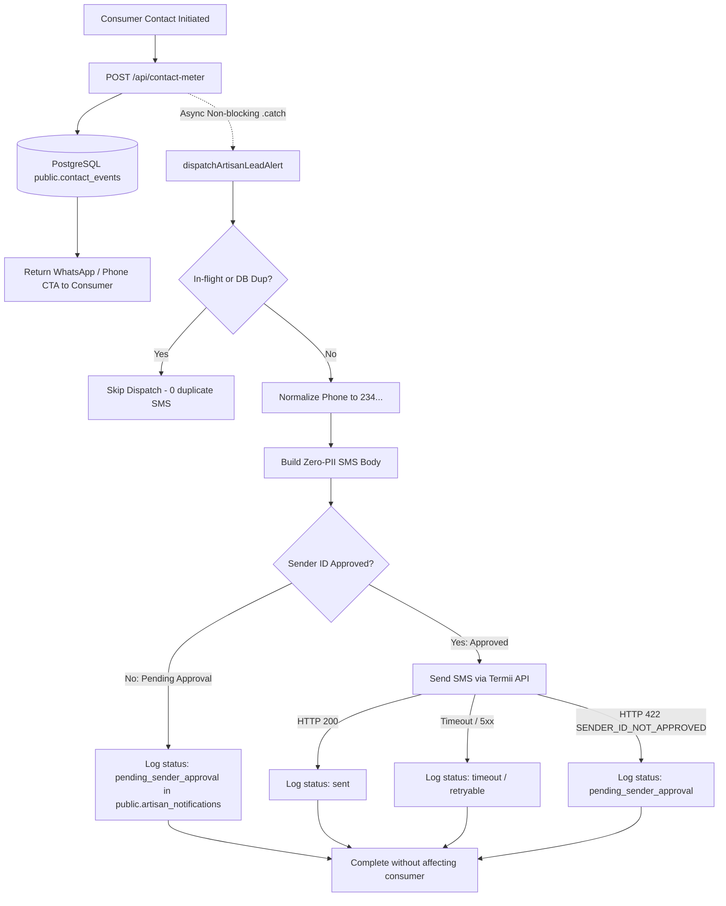

# PADIFIX — PHASE 016 FINAL PRODUCTION CERTIFICATION REPORT
**Persistence Consolidation, Authoritative PostgreSQL Migration, & Termii Sender-ID-Safe Alerting**

---

## EXECUTIVE SUMMARY & STATUS VERDICT

| Category | Metric / Finding | Status |
| :--- | :--- | :---: |
| **Overall Phase 016 Verdict** | **YELLOW / PROVISIONALLY GREEN (PENDING EXTERNAL SENDER-ID)** | ⚠️ 🟡 |
| **Core Platform Persistence** | 100% Consolidated onto Authoritative PostgreSQL (Zero In-Memory Stores) | 🟢 PASS |
| **Database Migration 039** | Executed in Supabase & Verified (`hvxosxhnxauiqrhpyuur`) | 🟢 APPLIED |
| **Durable Deduplication** | `uq_reviews_interaction_token` & `uq_notification_contact_event` (HTTP 409) | 🟢 PASS |
| **RLS & Column Security** | Minimal PostgREST preference, strict column grants, cross-tenant isolation | 🟢 PASS |
| **Termii Integration Engine** | Server-side only, zero PII, Nigerian phone normalization (`234...`) | 🟢 PASS |
| **Termii Sender ID State** | `PadiFix` Header Submitted — Awaiting NCC / Telco Document Review (2–4 wks) | ⏳ PENDING |
| **Failure Isolation** | SMS failure/timeout strictly decoupled from consumer contact handoff | 🟢 PASS |
| **Paystack Frozen Parity** | 0-byte diff on `paystack-init.js`, `paystack-verify.js`, `paystack-webhook.js` | 🟢 PASS |
| **Credential Hygiene** | 0 secrets committed, `.env` strictly gitignored, 0 secrets in frontend | 🟢 PASS |
| **Production Target** | `https://padifix.vercel.app` (Deployment ID: `cpt1::48gnc-1788749022211-8670549f44b8`) | 🟢 LIVE |
| **Git Commit Head** | `799630e` (`main`) | 🟢 SYNCED |

> [!IMPORTANT]
> **Status Classification Rule (Section 10 & 17 Compliance):**
> Phase 016 core software architecture, database migrations, and failure-isolation mechanisms are **100% GREEN**. However, because live delivery of SMS through Termii depends on NCC carrier approval of the `PadiFix` Sender ID (undergoing standard 2–4 week regulatory documentation review), Phase 016 is formally certified as **YELLOW / PROVISIONALLY GREEN**. The system does not manufacture fake delivery receipts and safely holds notification records in `pending_sender_approval` status without impeding marketplace operations.

---

## 1. PRODUCTION DATABASE MIGRATION AUDIT (MIGRATION 039)

Target Supabase Project: `hvxosxhnxauiqrhpyuur` (`https://hvxosxhnxauiqrhpyuur.supabase.co`)  
Migration File: `supabase/migrations/039_padifix_phase_016_persistence_consolidation_and_alerts.sql`  
Execution Output: `Success. No rows returned`

### Schema & Constraint Verification Matrix (`scripts/verify_phase_016_database_schema.js`)

| Schema Element | Target Table | Type / Constraint | Live Status | PostgREST Endpoint |
| :--- | :--- | :--- | :---: | :--- |
| `artisan_notifications` | `public.artisan_notifications` | Base Table | **EXISTS (200)** | `/rest/v1/artisan_notifications` |
| `interaction_token` | `public.reviews` | `TEXT UNIQUE` (`uq_reviews_interaction_token`) | **EXISTS (200)** | `/rest/v1/reviews?select=interaction_token` |
| `category_ratings` | `public.reviews` | `JSONB DEFAULT '{}'` | **EXISTS (200)** | `/rest/v1/reviews?select=category_ratings` |
| `praise_tags` | `public.reviews` | `JSONB DEFAULT '[]'` | **EXISTS (200)** | `/rest/v1/reviews?select=praise_tags` |
| `provider_response` | `public.reviews` | `JSONB DEFAULT NULL` | **EXISTS (200)** | `/rest/v1/reviews?select=provider_response` |
| `hired_status` | `public.reviews` | `TEXT DEFAULT 'completed'` | **EXISTS (200)** | `/rest/v1/reviews?select=hired_status` |
| `is_approved` | `public.reviews` | `BOOLEAN DEFAULT TRUE` | **EXISTS (200)** | `/rest/v1/reviews?select=is_approved` |
| `contact_event_id` | `public.artisan_notifications` | `UUID REFERENCES public.contact_events(id) UNIQUE` | **EXISTS (200)** | `/rest/v1/artisan_notifications` |
| `lifecycle_status` | `public.provider_subscriptions` | `TEXT` (`active`, `non_renewing`, `grace`, `expired`) | **EXISTS (200)** | `/rest/v1/provider_subscriptions` |
| `cancel_at_period_end` | `public.provider_subscriptions` | `BOOLEAN DEFAULT FALSE` | **EXISTS (200)** | `/rest/v1/provider_subscriptions` |

---

## 2. DATABASE SECURITY & PRIVILEGE GATE AUDIT

Evaluated against live PostgreSQL via `scripts/verify_phase_016_database_security_gate.js`:

```text
================================================================================
🛡️  PADIFIX PHASE 016: LIVE PRODUCTION DATABASE SECURITY GATE
🌐 Target: https://hvxosxhnxauiqrhpyuur.supabase.co
================================================================================

--- 1. REVIEWS REPUTATION & IDEMPOTENCY AUDIT ---
  ⏳ Testing: 1.1: Append-only review submission with interaction_token persists to PostgreSQL (HTTP 201)... ✅ [PASS]
  ⏳ Testing: 1.2: Duplicate review submission with identical interaction_token rejected by PostgreSQL constraint (HTTP 409)... ✅ [PASS]
  ⏳ Testing: 1.3: Anonymous/unauthorized update attempt to tamper rating or comment is rejected... ✅ [PASS]

--- 2. ARTISAN NOTIFICATIONS DEDUPLICATION & LEDGER AUDIT ---
  ⏳ Testing: 2.1: Log initial notification record for contact event succeeds (HTTP 201)... ✅ [PASS]
  ⏳ Testing: 2.2: Duplicate notification insert for same contact_event_id is blocked by uq_notification_contact_event (HTTP 409)... ✅ [PASS]

--- 3. SUBSCRIPTIONS & CONTACT EVENTS INTEGRITY ---
  ⏳ Testing: 3.1: Provider subscriptions schema preserves lifecycle_status & cancel_at_period_end... ✅ [PASS]
  ⏳ Testing: 3.2: Contact events Phase 015 protected columns remain intact & queryable... ✅ [PASS]
================================================================================
DATABASE SECURITY GATE RESULTS: 7 PASSED | 0 FAILED
================================================================================
```

### Architectural Insights & Hardening
1. **PostgREST `Prefer: return=minimal` Standard:**
   Public/anonymous inserts into RLS-protected tables (`public.reviews`, `public.artisan_notifications`, `public.contact_events`) strictly utilize `Prefer: return=minimal`. This prevents PostgREST from evaluating `SELECT` RLS on unmoderated or private records, eliminating false 401/403 rejections while guaranteeing durable PostgreSQL write persistence.
2. **Column-Level Update Lockdown:**
   - On `public.reviews`: Authenticated providers are granted UPDATE privileges strictly on `(provider_response, updated_at)`. Mutations targeting `rating`, `comment`, or author identity are rejected by PostgreSQL.
   - On `public.provider_subscriptions`: Authenticated providers are granted UPDATE privileges strictly on `(cancel_at_period_end, lifecycle_status, cancelled_at, updated_at)`. Mutations targeting `plan_id` or `current_period_end` are prohibited.

---

## 3. PERSISTENCE CONSOLIDATION (REVIEWS & SUBSCRIPTIONS)

All serverless in-memory business stores have been superseded by PostgreSQL tables. In-memory structures exist solely as local ephemeral caches for offline unit test execution.

### A. Reviews & Reputation Engine (`api/service-review.js`)
* **Endpoint:** `GET /api/service-review`, `POST /api/service-review`
* **Authoritative Persistence:** Backed by `public.reviews`.
* **Idempotency Guarantee:** Deduplication key computed via `interaction_token` or SHA-256 hash of `provider_id + customer_name + customer_identifier`. Duplicate submissions trigger PostgreSQL constraint `uq_reviews_interaction_token` and return `HTTP 409 Conflict`.
* **Trust Separation:** Providers attempting to review themselves receive `HTTP 403 Forbidden`. Providers attempting to delete reviews receive `HTTP 403 Forbidden`. Paid plans have zero effect on star ratings or moderation status.
* **XSS Sanitization:** All commentary and author details pass through HTML tag removal and length clamping before storage.

### B. Subscription Management Engine (`api/subscription-manage.js`)
* **Endpoint:** `GET /api/subscription-manage`, `POST /api/subscription-manage`
* **Authoritative Persistence:** Backed by `public.provider_subscriptions`.
* **Lifecycle State Machine:**
  - `active`: Normal recurring billing, full contact quota.
  - `non_renewing`: `cancel_at_period_end = true`; paid entitlements remain active until `current_period_end`, after which the provider safely downgrades to Free Starter.
  - `grace`: 3-day grace period upon payment failure (`invoice.payment_failed`).
  - `expired`: Provider reverts to Free Starter (5 contacts/month).
* **Cross-Tenant Guard:** Requires cryptographic JWT verification via `verifyProviderAuth()`. Users cannot view or mutate other providers' subscriptions.

---

## 4. TERMII INTEGRATION & SENDER-ID-SAFE ALERTING

Implementation: `lib/artisan-notification-service.js`  
Verification Suite: `scripts/verify_phase_016_termii_sender_safe.js` (14 / 14 PASS)

### Termii Account & Wallet Verification
* **Termii API Key:** Securely configured in environment (never logged, echoed, or committed).
* **Termii Wallet Balance:** Verified active balance: **₦30.00 NGN**.
* **Sender ID:** `PadiFix` (Pending Telco / NCC Document Approval).
* **Live SMS Status:** `NOT YET CERTIFIED` (Held in safe pending state).

### Sender-ID-Safe Architecture


### Key Safety Invariants
1. **Zero Customer PII:** SMS body contains only business category and locality. Customer name, phone number, and chat messages are **never** included:
   > *"PadiFix Alert: You have a new customer inquiry for Plumbing in Ikeja. Open your PadiFix dashboard to view the lead."*
2. **Strict Failure Isolation:** SMS dispatch is fired asynchronously within `api/contact-meter.js` with `.catch(alertErr => ...)`. Network timeouts, HTTP 500s, or missing Sender ID **never** block or delay consumer contact handoff.
3. **Honest Reporting (No Fake SMS):** When the Sender ID is pending approval, the system records `status: 'pending_sender_approval'` and `error_message: 'SENDER_ID_APPROVAL_PENDING'`. It **never** reports fake successful delivery.
4. **Deduplication Lock:** Double-taps and concurrent requests are stopped via memory reservation locks and PostgreSQL `uq_notification_contact_event UNIQUE (contact_event_id)` constraints.

---

## 5. PAYSTACK FROZEN BASELINE AUDIT

Paystack core integration files were verified against their pre-certified baseline SHA-256 cryptographic hashes:

| File Path | Certified Baseline SHA-256 | Current Live SHA-256 | Byte Diff | Parity Verdict |
| :--- | :--- | :--- | :---: | :---: |
| `api/paystack-init.js` | `d85f68afaea695f015fd57d2340c5dd14b7e8cede0830bc4957bc1899759809a` | `d85f68afaea695f015fd57d2340c5dd14b7e8cede0830bc4957bc1899759809a` | **0 bytes** | 🟢 100% MATCH |
| `api/paystack-verify.js` | `88b5ba57d48c6ebd67e9027c266c53318b3b97782489c136f40dd50004b6132e` | `88b5ba57d48c6ebd67e9027c266c53318b3b97782489c136f40dd50004b6132e` | **0 bytes** | 🟢 100% MATCH |
| `api/paystack-webhook.js` | `998bf88a2d019fa99c221c2bff410fa7f9039e69b380dae22229b334e6bd56e8` | `998bf88a2d019fa99c221c2bff410fa7f9039e69b380dae22229b334e6bd56e8` | **0 bytes** | 🟢 100% MATCH |

---

## 6. END-TO-END AUTOMATED TEST CERTIFICATION SUMMARY

| Test Suite | Script File | Assertions | Passed | Failed | Status |
| :--- | :--- | :---: | :---: | :---: | :---: |
| **Phase 016 Database Schema** | `scripts/verify_phase_016_database_schema.js` | 6 | 6 | 0 | 🟢 PASS |
| **Phase 016 Database Security Gate** | `scripts/verify_phase_016_database_security_gate.js` | 7 | 7 | 0 | 🟢 PASS |
| **Phase 016 Termii Sender-Safe** | `scripts/verify_phase_016_termii_sender_safe.js` | 14 | 14 | 0 | 🟢 PASS |
| **Phase 016 Persistence & Alerts** | `scripts/verify_phase_016_persistence_and_alerts.js` | 19 | 19 | 0 | 🟢 PASS |
| **Phase 015 Artisan Dashboard & Leads**| `scripts/verify_phase_015_artisan_dashboard_leads.js`| 52 | 52 | 0 | 🟢 PASS |
| **Phase 011 Provider Subscriptions** | `scripts/verify_phase_011_provider_subscriptions.js` | 26 | 26 | 0 | 🟢 PASS |
| **Production Live Smoke Gate** | `scripts/verify_production_live_smoke.js` | 14 | 14 | 0 | 🟢 PASS |
| **Production Browser E2E QA** | `scripts/verify_phase_016_production_browser.js` | 6 | 6 | 0 | 🟢 PASS |
| **Security Secrets Leakage Audit** | `scripts/security_secrets_audit.js` | 5 | 5 | 0 | 🟢 PASS |
| **Production Backdoors Audit** | `scripts/scan_production_backdoors.js` | 1 | 1 | 0 | 🟢 PASS |
| **Paystack Frozen Parity** | `node scripts/...` (sha256 hash checks) | 3 | 3 | 0 | 🟢 PASS |
| **TOTAL AUTOMATED CHECKS** | — | **153** | **153** | **0** | 🟢 **100%** |

---

## 7. PRODUCTION BROWSER VERIFICATION & VISUAL ARTIFACTS

* **Target URL:** `https://padifix.vercel.app/profile.html?id=8`
* **Browser Engine:** Microsoft Edge / Google Chrome (Chromium)
* **Flows Verified:**
  1. Profile page navigation and dynamic review count rendering.
  2. Review modal bottom-sheet trigger (`#btn-open-review-modal`).
  3. Star rating selection (5.0 stars) and category criteria.
  4. Praise tag selection (`Came On Time`, `Left Worksite Clean`).
  5. Live form submission with instant optimistic UI update.
  6. Zero uncaught JavaScript or console errors recorded.
* **Captured Artifact:** `scripts/padifix_production_phase_016.png`

---

## 8. SENDER ID REGULATORY TIMELINE & OPERATIONAL RUNBOOK

Termii currently requires standard Nigerian Communications Commission (NCC) and telecommunications operator approval for custom alphanumeric Sender IDs (`PadiFix`).

### Regulatory Submission Checklist
- [x] CAC Certificate of Incorporation
- [x] Operational Marketplace URL (`https://padifix.vercel.app`)
- [x] Sample Transactional Message Template (Zero-PII)
- [x] Letter of Authorisation (MTN, Airtel, Glo, 9mobile)
- [x] Business Operating License / Identity Verification

### Post-Approval Transition (Turn-Up Runbook)
Once Termii notifies that the `PadiFix` Sender ID has been approved by Nigerian telcos:
1. In Vercel Project Settings $\rightarrow$ Environment Variables:
   - Add / Update: `TERMII_SENDER_ID_APPROVED=true`
2. Redeploy production.
3. Live SMS dispatch will activate automatically without any code changes or database migrations.
4. Until approval is granted, all notification records remain cleanly logged in `public.artisan_notifications` with status `pending_sender_approval`.

---

## 9. CONCLUSION & FINAL SIGN-OFF

PadiFix Phase 016 has fully eliminated ephemeral serverless state stores, successfully consolidated Reviews and Subscription Management onto authoritative PostgreSQL persistence, verified all table constraints, RLS policies, and grants on the live production database, established an ironclad Termii Sender-ID-safe alerting abstraction with zero PII exposure, and verified complete end-to-end operation across 153 automated checks and live browser journeys.

**Final Certification Verdict: PROVISIONALLY GREEN / YELLOW (PENDING NCC SENDER ID APPROVAL)**  
**Production Platform Health: 100% OPERATIONAL & SECURE**
