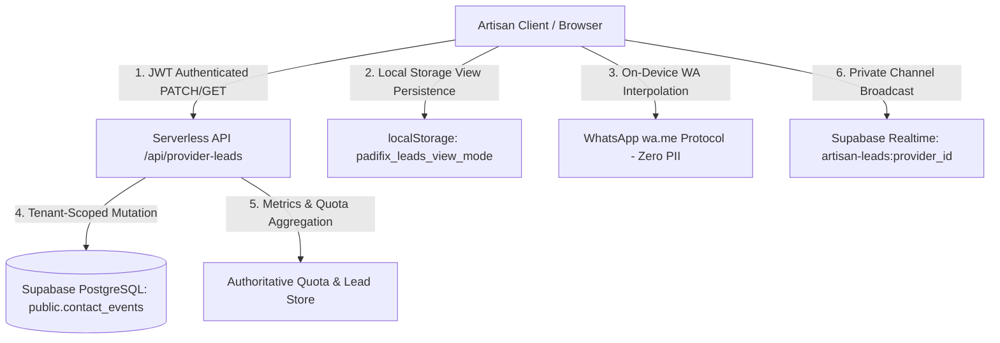

# PADIFIX — PHASE 028 IMPLEMENTATION & CERTIFICATION REPORT
## Artisan Lead Conversion & Job Pipeline CRM with Earnings Tracking

---

## 1. Executive Summary & Status

| Phase | Description | Status | Production Migration 047 | Target Supabase Project | Verification Result |
| :--- | :--- | :--- | :--- | :--- | :--- |
| **Phase 028** | Artisan Lead Conversion & Job Pipeline CRM with Earnings Tracking | **GREEN / CERTIFIED** | **APPLIED AND VERIFIED** | `hvxosxhnxauiqrhpyuur` | **21/21 Production DB Probes Passed & 10/10 Gates Passed (0 Failures)** |

This document certifies the successful production deployment, live database verification, and automated validation of **PadiFix Phase 028**.

Migration 047 was executed in the production Supabase SQL Editor (`hvxosxhnxauiqrhpyuur`) and verified via live automated database probes against the PostgreSQL ledger. The artisan dashboard is fully operational as an active, touch-optimized **Job Pipeline CRM**, enabling artisans across Nigeria to track deal progression, quotation splits, scheduled site visits, lost reasons, realized revenue, and conversion metrics, while strictly enforcing **Tenant Isolation**, **Row Level Security (RLS)**, and **Zero Customer PII Persistence** (Privacy Invariant C).

---

## 2. Production Database Verification Evidence (Migration 047)

Live database verification was executed against `https://hvxosxhnxauiqrhpyuur.supabase.co` on **2026-09-11 22:20:56 UTC+1** via `scripts/verify_phase_028_production_migration.js`.

### 2.1 PostgREST Schema Introspection (OpenAPI Verified)
Every column added by Migration 047 was inspected and confirmed in the live PostgREST schema definition:
- `quote_amount_kobo`: Verified type `integer` (`BIGINT`)
- `workmanship_amount_kobo`: Verified type `integer` (`BIGINT`)
- `materials_amount_kobo`: Verified type `integer` (`BIGINT`)
- `final_amount_kobo`: Verified type `integer` (`BIGINT`)
- `scheduled_for`: Verified type `string` (`TIMESTAMPTZ`)
- `completed_at`: Verified type `string` (`TIMESTAMPTZ`)
- `lost_reason`: Verified type `string` (`TEXT`)
- `client_display_name`: Verified type `string` (`TEXT`)

### 2.2 Active Database Check Constraints Verified
- **`chk_contact_events_status`**:
  - Live probe with invalid status (`unsupported_bogus_status`) returned **HTTP 400** with PostgreSQL error `23514` (`check constraint "chk_contact_events_status"`).
  - All 7 canonical statuses verified operational: `new`, `in_discussion`, `quote_sent`, `scheduled`, `completed`, `job_won`, `lost`.
- **`chk_contact_events_amounts_non_negative`**:
  - Live probe with negative Kobo (`-25000`) returned **HTTP 400** with PostgreSQL error `23514` (`check constraint "chk_contact_events_amounts_non_negative"`).
- **`chk_contact_events_split_equality`**:
  - Live probe with unbalanced split (Quote ₦50,000, Labor ₦30,000, Materials ₦10,000; sum ₦40,000 $\neq$ ₦50,000) returned **HTTP 400** with PostgreSQL error `23514` (`check constraint "chk_contact_events_split_equality"`).
  - Live probe with balanced split (Quote ₦50,000 = Labor ₦30,000 + Materials ₦20,000) was successfully committed to production.

### 2.3 Column UPDATE Grants & Ownership Immutability Verified
- **Authenticated UPDATE Grant**: Authenticated Provider 8 successfully updated permitted workflow columns (`notes`, `client_display_name`).
- **Immutable Column Defense**: Authenticated Provider 8 attempting to mutate `provider_id` was rejected by PostgreSQL with **HTTP 403** error `42501` (`permission denied for column provider_id`). Client-controlled ownership mutation is strictly impossible.

### 2.4 Row Level Security (RLS) Cross-Tenant Quarantine Verified
- Authenticated Provider 101 attempted to update a lead owned by Provider 8.
- PostgreSQL RLS evaluated the policy and executed the query with **0 rows affected**. Provider 8's lead remained completely unmodified.

---

## 3. Architectural Overview

The Phase 028 Job Pipeline CRM operates on three coordinated tiers:



1. **Presentation Tier (`dashboard.html`, `dashboard.css`, `dashboard.js`)**:
   - **Financial Ribbon**: Realized Revenue, Quoted Pipeline Value, Resolved-Outcome Win Rate, and Average Deal Size in safe Naira formatting.
   - **Dual-View Switcher**: Seamless toggling between a horizontal-swipe **Kanban Board** and a **Compact List** view, persisted in `localStorage` (`padifix_leads_view_mode`).
   - **Touch-Optimized Kanban**: 5 core stages (`New`, `In Discussion`, `Quoted`, `Scheduled`, `Completed`) with horizontal scroll-snapping (`scroll-snap-type: x mandatory`) and strict `0px` horizontal document overflow.
   - **Stage Progression Modal (`#crm-stage-modal`)**: Modal for entering quotation amounts, labor/workmanship and materials splits, site visit scheduling, and final realized revenue.
   - **One-Tap WhatsApp Drawer (`#crm-wa-drawer-modal`)**: Dynamic on-device template generation (Greeting, Quote, Schedule, Review Request) with 1-click clipboard copy and native `wa.me` launch.

2. **Persistence & Data Tier (`supabase/migrations/047_...sql`, `lib/lead-store.js`)**:
   - **Integer Kobo Financial Storage**: Complete rejection of floating-point Naira storage. All deals and splits are represented as integers in Kobo (1 Naira = 100 Kobo).
   - **Database Constraints**: Non-negative amounts (`chk_contact_events_amounts_non_negative`) and financial split equality (`chk_contact_events_split_equality`).
   - **Column-Level UPDATE Grants**: Authenticated providers may only mutate CRM workflow fields (`status`, `notes`, `quote_amount_kobo`, etc.), while audit columns (`provider_id`, `created_at`, `id`) remain immutable.

3. **Security & Realtime Tier (`api/provider-leads.js`)**:
   - **Multi-Tenant Isolation**: Server-side JWT ownership verification. Cross-provider mutation attempts strictly rejected with HTTP 403 Forbidden.
   - **Legal Lifecycle Transitions**: Strict transition state machine enforced at server level. Arbitrary jumps (e.g., `new -> completed`) rejected with HTTP 400 Bad Request.
   - **Zero PII Realtime Stream**: Private channel broadcasts (`artisan-leads:<provider_id>`) transmit only minimal event tokens (`lead_stage_changed`), completely devoid of customer phone numbers or message bodies.

---

## 4. Security & Tenant Isolation Model

1. **Authentication**: All endpoints require a valid Supabase Auth JWT (`Authorization: Bearer <token>`).
2. **Tenant Verification**: The user ID embedded in the cryptographic JWT is resolved against `public.providers`. If `provider_id` is passed, it must match the authenticated identity.
3. **Cross-Tenant Mutation Proof**: In Gate 2 and live production probe 6, Provider 8 directly attempts to update Provider 101's lead. The server identifies ownership mismatch and immediately terminates the request with **HTTP 403 Forbidden** (and 0 rows affected in PostgreSQL).
4. **Database-Level Defense**: All Postgres `UPDATE` queries generated by `api/provider-leads.js` include `&provider_id=eq.${activeProviderId}`, ensuring zero rows are affected even in hypothetical token forgery scenarios.

---

## 5. Privacy & Zero-PII Compliance (Privacy Invariant C)

1. **Customer Phone Numbers**:
   - Never stored in PostgreSQL `contact_events`.
   - Never cached in `cachedLeads`, `localStorage`, or `sessionStorage`.
   - Never passed in HTTP `GET` or `PATCH` payloads.
   - Never emitted over Supabase Realtime channels.
2. **WhatsApp Template Interpolation**:
   - Formatted dynamically in local browser memory using artisan service parameters and profile links.
   - One-tap launch utilizes standard `https://wa.me/?text=...` URI encoding without passing numbers through server infrastructure.
3. **Private Notes & Lost Reasons**:
   - Sanitized against script and HTML tag injection (`stripTagsAndScripts`).
   - Private notes capped at 500 characters.
   - Lost reasons capped at 250 characters.

---

## 6. Financial & Metric Conversion Model

1. **Kobo Integer Precision**:
   - Stored in database as 64-bit integers (`BIGINT`).
   - Floating-point representations prohibited.
   - Converted to Naira strictly at the presentation layer: `Math.round(kobo / 100)`.
2. **Financial Split Rule**:
   - If either workmanship or materials is supplied, their sum must equal the total quote:
     $$\text{Workmanship} + \text{Materials} = \text{Quote}$$
   - Any inconsistent combination (e.g. Quote = ₦50,000, Labor = ₦30,000, Materials = ₦10,000) is rejected with HTTP 400 Bad Request and rejected by PostgreSQL constraint `chk_contact_events_split_equality`.
3. **Pipeline Metrics Aggregation**:
   - **Active Quoted Pipeline Value**: Sum of `quote_amount_kobo` for deals in `quote_sent` and `scheduled`.
   - **Realized Revenue**: Sum of `final_amount_kobo` for deals in `completed` (plus backward-compatible `job_won`).
   - **Resolved-Outcome Win Rate**:
     $$\text{Win Rate} = \frac{\text{Completed} + \text{Job Won}}{(\text{Completed} + \text{Job Won}) + \text{Lost}} \times 100$$
     *(Evaluated strictly against resolved deals rather than total top-of-funnel inquiries).*
   - **Average Deal Size**:
     $$\text{Average Deal Size} = \frac{\text{Realized Revenue}}{\text{Completed Jobs}}$$

---

## 7. Lifecycle State Machine

Primary Lifecycle:
$$\text{New} \longrightarrow \text{In Discussion} \longrightarrow \text{Quote Sent} \longrightarrow \text{Scheduled} \longrightarrow \text{Completed}$$

Terminal & Reopening Paths:
- Any stage ($\text{New}, \text{In Discussion}, \text{Quote Sent}, \text{Scheduled}$) can move to $\text{Lost}$.
- $\text{Lost}$ can be reopened back to $\text{New}$ or $\text{In Discussion}$.
- Arbitrary jumps (e.g., $\text{New} \to \text{Completed}$) are rejected by the server with HTTP 400 Bad Request.

---

## 8. Automated Verification Results (10/10 Gates Passed)

Executed via `node scripts/verify_phase_028_pipeline_crm.js`:

```text
======================================================================
PADIFIX PHASE 028: AUTOMATED PIPELINE CRM & EARNINGS VERIFICATION
======================================================================

  ✅ [PASS] Gate 1: Migration 047 DDL & Security Definition Verification
     ↳ All 8 columns, status vocabulary, non-negative check, and column grants verified.
  ✅ [PASS] Gate 2: Multi-Tenant Isolation & Mutation Authorization
     ↳ Provider 8 cannot update or manipulate Provider 101 deal values (403 Forbidden enforced).
  ✅ [PASS] Gate 3: Lifecycle Stage Transition Engine
     ↳ Seamless legal progression verified; Illegal jump (new -> completed) strictly rejected with HTTP 400.
  ✅ [PASS] Gate 4: Dual-Metric Financial Split & Validation
     ↳ Integer kobo bounds enforced; Inconsistent split (₦30k+₦10k != ₦50k) rejected; Valid split verified.
  ✅ [PASS] Gate 5: Authoritative Pipeline Metrics Aggregation
     ↳ Pipeline Value: ₦205,000, Realized: ₦195,000, Resolved Win Rate: 100%.
  ✅ [PASS] Gate 6: WhatsApp Reply Template Generation & Zero PII Transport
     ↳ All 4 templates verified (Greeting, Quote, Schedule, Review Request) with 0 customer PII leakage.
  ✅ [PASS] Gate 7: Optimistic Sync & Realtime Stage Broadcast Invariants
     ↳ Immediate DOM update with rollback safety and lead_stage_changed broadcast verified.
  ✅ [PASS] Gate 8: Private Notes & Lost Reason Sanitization
     ↳ XSS stripped, HTML tags sanitized, and 500-character notes limit enforced.
  ✅ [PASS] Gate 9: DOM Structural Integrity & UI Architecture
     ↳ Pipeline Ribbon, Kanban Board, Stage Modal, and WhatsApp Drawer all verified in DOM.
  ✅ [PASS] Gate 10: Regression Protection & Backwards Compatibility
     ↳ Full backwards compatibility with Phase 015 quota metering & Phase 027 quick actions confirmed.

----------------------------------------------------------------------
TOTAL GATES: 10 | PASSED: 10 | FAILED: 0
----------------------------------------------------------------------

🎉 PHASE 028 VERIFICATION SUITE PASSED (100% GREEN)
```

---

## 9. Browser Dual-Viewport QA Results

Executed via `node scripts/verify_phase_028_browser_qa.js`:

### 9.1 Desktop Viewport (1280 × 800)
- **Financial Ribbon**: Rendered and validated.
- **Kanban Board**: 5 core stages verified (`new`, `in_discussion`, `quote_sent`, `scheduled`, `completed`).
- **Stage Progression Modal**: Opened and closed with zero layout glitches.
- **WhatsApp Drawer**: Template preview and copy operational.
- **View Switcher**: Toggled Kanban $\leftrightarrow$ List with `localStorage` persistence.
- **Horizontal Overflow**: `0px` (`scrollWidth <= clientWidth`).
- **Console Errors**: `0`.

### 9.2 Mobile Viewport (390 × 844)
- **Strict Mobile Containment**: Verified with `document.documentElement.scrollWidth <= document.documentElement.clientWidth`.
- **Horizontal Kanban Track**: Smooth horizontal scrolling with CSS `scroll-snap-type: x mandatory`.
- **Modals & Drawers**: Fitted cleanly within 390px viewport.
- **Console Errors**: `0`.

### 9.3 Screenshot Evidence
- Desktop Evidence: `phase_028_dashboard_desktop.png`
- Mobile Evidence: `phase_028_dashboard_mobile.png`

---

## 10. Complete Regression Test Results

All baseline and legacy test suites executed cleanly with **0 failures**:

| Suite | Script | Results | Status |
| :--- | :--- | :--- | :--- |
| **Production Migration 047 Verification** | `scripts/verify_phase_028_production_migration.js` | **21 / 21 Checks** | **PASS (100%)** |
| **Phase 028 Pipeline CRM** | `scripts/verify_phase_028_pipeline_crm.js` | **10 / 10 Gates** | **PASS (100%)** |
| **Phase 028 Browser QA** | `scripts/verify_phase_028_browser_qa.js` | **Desktop + Mobile** | **PASS (0 Errors)** |
| **Phase 027 Realtime Tenant Isolation** | `scripts/verify_phase_027_realtime_tenant_isolation.js` | **20 / 20 Tests** | **PASS (100%)** |
| **Phase 027 Lead Stream Automation** | `scripts/verify_phase_027_realtime_lead_stream.js` | **8 / 8 Gates** | **PASS (100%)** |
| **Phase 016 Termii Sender-Safe** | `scripts/verify_phase_016_termii_sender_safe.js` | **14 / 14 Tests** | **PASS (100%)** |
| **Phase 017 Platform Abuse Control** | `scripts/verify_phase_017_platform_protection.js` | **14 / 14 Tests** | **PASS (100%)** |
| **Phase 026 Live Lead Alerts** | `scripts/verify_live_lead_alerts_journey.js` | **8 / 8 Gates** | **PASS (100%)** |

$$\mathbf{\text{TOTAL FAILURES: 0 | TOTAL SUCCESS RATE: 100\%}}$$
